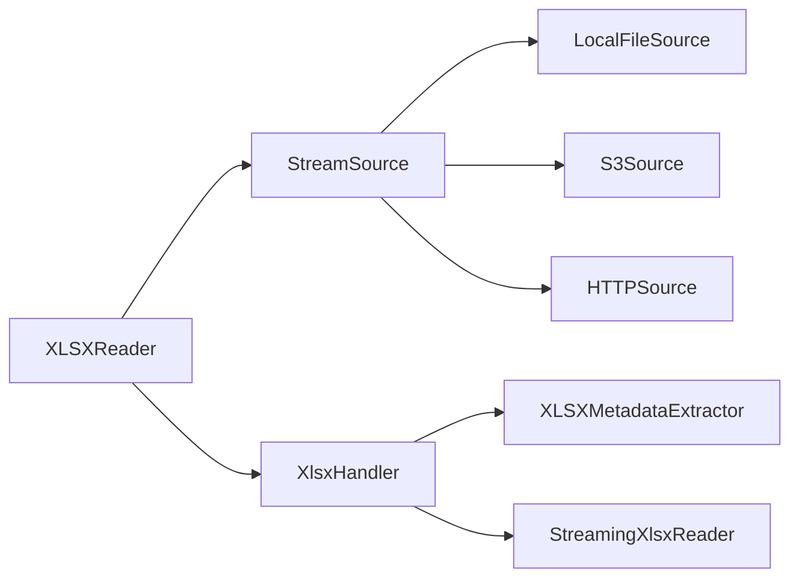

# `xlsx-streamer` User Guide

??? info "`python-blueprint` Project"

    For more information on how this was built and deployed, as well as other Python best
    practices, see [`python-blueprint`](https://github.com/johnthagen/python-blueprint).

## Installation

First, [install `uv`](https://docs.astral.sh/uv/getting-started/installation):

=== "macOS and Linux"

    ```bash
    curl -LsSf https://astral.sh/uv/install.sh | sh
    ```

=== "Windows"

    ```powershell
    powershell -ExecutionPolicy ByPass -c "irm https://astral.sh/uv/install.ps1 | iex"
    ```

Then install the `xlsx-streamer` package and its dependencies:

```bash
uv sync
```

### Optional Dependencies

For specific data sources, install the appropriate extras:

```bash
# For S3 support
uv sync --extra s3

# For HTTP/HTTPS support
uv sync --extra http

# For all optional dependencies
uv sync --extra all
```

## Quick Start

### Command Line Interface

Stream an XLSX file to CSV format:

=== "Local File"

    ```bash
    uv run xlsx-streamer /path/to/file.xlsx
    ```

=== "S3 File"

    ```bash
    uv run xlsx-streamer s3://bucket/path/to/file.xlsx
    ```

=== "HTTP/HTTPS File"

    ```bash
    uv run xlsx-streamer https://example.com/file.xlsx
    ```

Save output to a file:

```bash
uv run xlsx-streamer /path/to/file.xlsx --output output.csv
```

Read a specific sheet:

```bash
uv run xlsx-streamer /path/to/file.xlsx --sheet-name "Sheet2"
```

Enable verbose logging:

```bash
uv run xlsx-streamer /path/to/file.xlsx --verbose
```

### Python API

To use `xlsx-streamer` as a library within your project:

*[API]: Application Programming Interface

```python
from xlsx_streamer import XLSXReader

# Read from local file
reader = XLSXReader("/path/to/file.xlsx")

# Stream rows
for row in reader.stream_rows():
    print(row)  # Each row is a list of cell values

# Convert to CSV
reader.to_csv("output.csv")
```

#### Reading from Different Sources

=== "Local File"

    ```python
    from xlsx_streamer import XLSXReader

    reader = XLSXReader("/path/to/file.xlsx")
    reader.to_csv("output.csv")
    ```

=== "S3"

    ```python
    from xlsx_streamer import XLSXReader

    reader = XLSXReader("s3://bucket/path/to/file.xlsx")
    reader.to_csv("output.csv")
    ```

=== "HTTP/HTTPS"

    ```python
    from xlsx_streamer import XLSXReader

    reader = XLSXReader("https://example.com/file.xlsx")
    reader.to_csv("output.csv")
    ```

#### Advanced Usage

Read a specific sheet:

```python
from xlsx_streamer import XLSXReader

reader = XLSXReader("/path/to/file.xlsx", sheet_name="Sheet2")
for row in reader.stream_rows():
    print(row)
```

Use custom chunk size:

```python
from xlsx_streamer import XLSXReader

# Use 32MB chunks instead of default 16MB
reader = XLSXReader("/path/to/file.xlsx", chunk_size=33554432)
reader.to_csv("output.csv")
```

Get metadata about the source:

```python
from xlsx_streamer import XLSXReader

reader = XLSXReader("/path/to/file.xlsx")
metadata = reader.get_metadata()
print(metadata)  # {'source_type': 'local', 'size': 12345, ...}
```

!!! tip

    Within PyCharm, use ++tab++ to auto-complete suggested imports while typing.

## Features

- **Memory Efficient**: Streams large XLSX files without loading them entirely into memory
- **Multiple Sources**: Read from local files, S3, or HTTP/HTTPS URLs
- **Simple API**: Unified interface for all data sources
- **CLI Tool**: Command-line interface for quick conversions
- **Type Safe**: Full type hints with mypy support
- **Well Tested**: Comprehensive test suite with 90%+ coverage

## Architecture

`xlsx-streamer` uses a modular architecture with pluggable data sources:



Each component is responsible for a specific aspect:

- **XLSXReader**: High-level API for users
- **StreamSource**: Abstract interface for data sources
- **XlsxHandler**: Orchestrates metadata extraction and row streaming
- **XLSXMetadataExtractor**: Extracts shared strings and worksheet paths
- **StreamingXlsxReader**: Parses worksheet XML and yields rows
